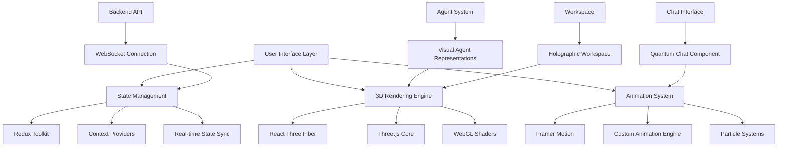

# Revolutionary UI Transformation Design Document

## Overview

This design document outlines the transformation of AgenticSeek into a world-class, visually stunning AI assistant interface that represents the pinnacle of modern web design. The new interface will combine cutting-edge 3D graphics, advanced animations, and revolutionary interaction paradigms to create an unprecedented user experience that feels like interacting with AI from the future.

The design leverages modern web technologies including React Three Fiber for 3D rendering, Framer Motion for advanced animations, WebGL shaders for visual effects, and a sophisticated component architecture that maintains performance while delivering stunning visuals.

## Architecture

### High-Level System Architecture



### Component Architecture

The interface will be built using a modular component architecture with the following key layers:

1. **Presentation Layer**: 3D visual components, animations, and user interface elements
2. **Logic Layer**: State management, data processing, and business logic
3. **Integration Layer**: API communication, WebSocket connections, and backend integration
4. **Performance Layer**: Optimization, caching, and resource management

### Technology Stack

- **Frontend Framework**: React 19 with TypeScript
- **3D Graphics**: React Three Fiber + Three.js
- **Animation**: Framer Motion + Custom animation engine
- **State Management**: Redux Toolkit with RTK Query
- **Styling**: Styled Components + CSS-in-JS
- **Build Tool**: Vite for optimal performance
- **WebGL Shaders**: Custom GLSL shaders for advanced effects

## Components and Interfaces

### 1. Neural Interface Core

The central component that orchestrates all visual elements and manages the overall user experience.

**Key Features:**
- 3D scene management and rendering
- Dynamic lighting and shadow systems
- Particle effect coordination
- Performance monitoring and optimization
- Responsive layout adaptation

**Interface:**
```typescript
interface NeuralInterfaceProps {
  theme: ThemeConfig;
  performance: PerformanceSettings;
  accessibility: AccessibilityOptions;
  agents: AgentState[];
  onInteraction: (interaction: InteractionEvent) => void;
}
```

### 2. Agent Constellation

A 3D visualization system that represents AI agents as interconnected nodes in a dynamic network.

**Key Features:**
- Real-time agent status visualization
- Dynamic connection mapping between agents
- Animated state transitions
- Interactive agent selection and information display
- Capability visualization through skill trees

**Visual Design:**
- Each agent represented as a unique 3D geometric form
- Pulsing energy connections between active agents
- Color-coded status indicators (idle, processing, error)
- Smooth morphing animations for state changes
- Particle trails showing data flow between agents

### 3. Thought Stream Visualizer

Real-time visualization of AI reasoning and decision-making processes.

**Key Features:**
- Neural network-style data flow visualization
- Real-time reasoning text display with typewriter effects
- Decision point highlighting and branching paths
- Confidence level indicators through visual intensity
- Expandable detailed reasoning views

**Visual Design:**
- Flowing particle streams representing thought processes
- Branching pathways for decision trees
- Pulsing nodes for key reasoning points
- Dynamic text rendering with contextual highlighting
- Smooth transitions between reasoning states

### 4. Holographic Workspace

A 3D workspace where users interact with AI-generated content and tools.

**Key Features:**
- 3D document and code visualization
- Interactive object manipulation with physics
- Multi-layered content organization
- Gesture-based interactions
- Collaborative workspace capabilities

**Visual Design:**
- Floating 3D panels for documents and code
- Realistic lighting and shadow effects
- Interactive physics for object manipulation
- Depth-of-field effects for focus management
- Ambient particle effects for atmosphere

### 5. Quantum Chat Interface

An advanced chat system with predictive capabilities and multi-dimensional conversation flows.

**Key Features:**
- Real-time typing predictions and suggestions
- Contextual auto-completion with confidence indicators
- Adaptive visual themes based on conversation context
- Branching conversation timeline visualization
- Advanced text rendering with dynamic typography

**Visual Design:**
- Floating suggestion bubbles with smooth animations
- Dynamic text formatting based on content type
- Conversation threads as interactive 3D timelines
- Contextual color schemes and visual themes
- Smooth morphing transitions between states

### 6. Reality Bridge

The integration layer that seamlessly connects AI capabilities with the user workspace.

**Key Features:**
- Real-time synchronization with backend systems
- WebSocket-based live updates
- State persistence across sessions
- Cross-device synchronization
- Offline capability with sync on reconnect

### 7. Consciousness Indicators

Visual representations of AI agent states, processing, and availability.

**Key Features:**
- Unique animated avatars for each agent type
- Real-time processing visualization
- Health and performance metrics display
- Capability and skill visualization
- Interactive agent information panels

## Data Models

### Agent State Model
```typescript
interface AgentState {
  id: string;
  name: string;
  type: AgentType;
  status: 'idle' | 'processing' | 'error' | 'offline';
  capabilities: Capability[];
  currentTask?: Task;
  performance: PerformanceMetrics;
  visualConfig: AgentVisualConfig;
}
```

### Thought Process Model
```typescript
interface ThoughtProcess {
  id: string;
  agentId: string;
  reasoning: ReasoningStep[];
  confidence: number;
  timestamp: Date;
  visualPath: Vector3[];
  connections: Connection[];
}
```

### Workspace Object Model
```typescript
interface WorkspaceObject {
  id: string;
  type: 'document' | 'code' | 'browser' | 'tool';
  position: Vector3;
  rotation: Vector3;
  scale: Vector3;
  content: any;
  interactions: InteractionHandler[];
  visualProperties: ObjectVisualProperties;
}
```

## Error Handling

### Visual Error States
- Graceful degradation for unsupported features
- Animated error indicators with contextual information
- Fallback 2D interfaces for performance-constrained devices
- User-friendly error messages with recovery suggestions

### Performance Error Handling
- Automatic quality adjustment based on device capabilities
- Frame rate monitoring with dynamic optimization
- Memory usage tracking and cleanup
- Progressive enhancement for advanced features

### Network Error Handling
- Offline mode with cached functionality
- Connection status visualization
- Automatic reconnection with visual feedback
- Data synchronization on reconnect

## Testing Strategy

### Visual Testing
- Screenshot comparison testing for visual consistency
- Cross-browser compatibility testing
- Performance testing across different devices
- Accessibility testing with screen readers and keyboard navigation

### 3D Rendering Testing
- WebGL compatibility testing
- Shader compilation testing
- 3D object interaction testing
- Animation performance testing

### Integration Testing
- Backend API integration testing
- WebSocket connection testing
- Real-time data synchronization testing
- Cross-component communication testing

### User Experience Testing
- Usability testing with target users
- Performance perception testing
- Accessibility compliance testing
- Mobile and touch interaction testing

## Performance Optimization

### 3D Rendering Optimization
- Level-of-detail (LOD) systems for complex 3D objects
- Frustum culling for off-screen objects
- Instanced rendering for repeated elements
- Texture atlasing and compression
- Shader optimization and caching

### Animation Optimization
- Hardware-accelerated animations using CSS transforms
- Animation frame scheduling and batching
- Reduced motion options for accessibility
- Smart animation culling for off-screen elements

### Memory Management
- Object pooling for frequently created/destroyed objects
- Texture and geometry cleanup
- Event listener management
- Component lifecycle optimization

### Network Optimization
- WebSocket connection pooling
- Data compression and batching
- Intelligent caching strategies
- Progressive loading for large assets

## Accessibility Features

### Visual Accessibility
- High contrast mode with maintained visual appeal
- Reduced motion options for motion-sensitive users
- Scalable text and interface elements
- Color-blind friendly color schemes

### Interaction Accessibility
- Full keyboard navigation support
- Screen reader compatibility
- Voice control integration
- Touch and gesture alternatives for all interactions

### Cognitive Accessibility
- Clear visual hierarchy and information organization
- Consistent interaction patterns
- Contextual help and guidance
- Simplified interface modes

## Implementation Phases

### Phase 1: Foundation (Weeks 1-4)
- Set up React Three Fiber and core 3D rendering
- Implement basic component architecture
- Create fundamental animation systems
- Establish state management patterns

### Phase 2: Core Components (Weeks 5-8)
- Develop Agent Constellation visualization
- Implement Thought Stream visualizer
- Create basic Holographic Workspace
- Build Quantum Chat interface foundation

### Phase 3: Advanced Features (Weeks 9-12)
- Add advanced visual effects and shaders
- Implement gesture-based interactions
- Create Reality Bridge integration
- Develop Consciousness Indicators

### Phase 4: Polish and Optimization (Weeks 13-16)
- Performance optimization and testing
- Accessibility implementation
- Cross-browser compatibility
- User experience refinement

### Phase 5: Integration and Launch (Weeks 17-20)
- Backend integration and testing
- Production deployment preparation
- Documentation and training materials
- Launch preparation and monitoring

## Technical Considerations

### Browser Compatibility
- WebGL 2.0 support for advanced features
- Fallback rendering for older browsers
- Progressive enhancement strategy
- Mobile browser optimization

### Performance Requirements
- Maintain 60fps for all animations
- Sub-100ms interaction response times
- Efficient memory usage (< 500MB for full interface)
- Fast initial load times (< 3 seconds)

### Security Considerations
- Secure WebSocket connections
- Input sanitization for 3D content
- Content Security Policy implementation
- Cross-origin resource sharing configuration

This design represents a revolutionary approach to AI assistant interfaces, combining cutting-edge web technologies with innovative user experience design to create an interface that truly feels like the future of human-AI interaction.